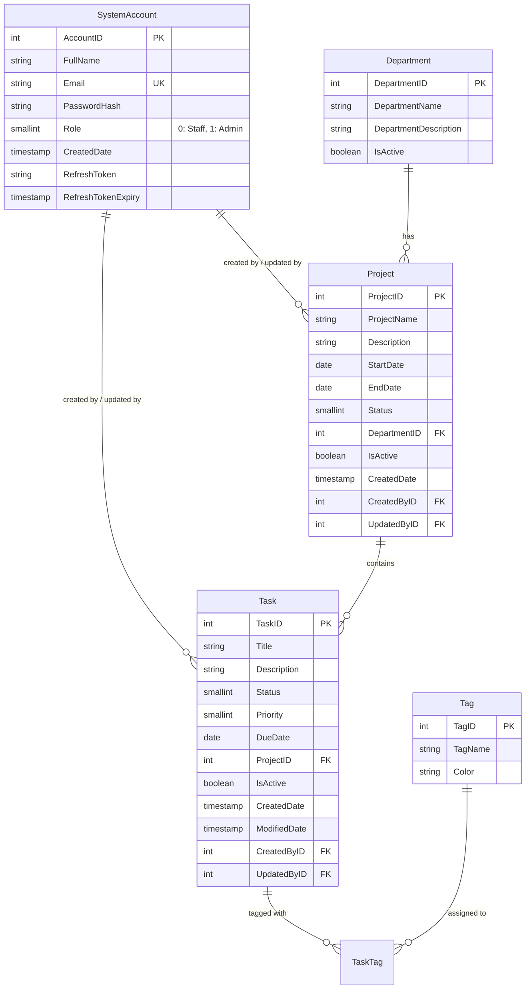

# TaskTrack - Task & Team Management Web Application

> **PRN232 Assignment 1 & Assignment 2: Full Stack Auth, Role-based Access & Protected Admin CRUD**  
> **Student ID**: QE190087 | **Class Code**: PRN232  
> **Tech Stack**: ASP.NET Core Web API (.NET 8) | PostgreSQL (Render) | Next.js 16 (App Router, TypeScript, Tailwind CSS)  
> **Repository**: [https://github.com/Phamtin147/prn232-ass1-ass2](https://github.com/Phamtin147/prn232-ass1-ass2)

---

## 🚀 Live Deployments & Test Credentials

| Service | Platform | Live URL |
| :--- | :--- | :--- |
| **Backend API & Swagger** | Render | `https://prn232-ass2.onrender.com` (hoặc `https://prn232-ass1.onrender.com`) |
| **Frontend Web App** | Vercel | `https://prn232-ass2-fe.vercel.app` |
| **PostgreSQL Database** | Render | Managed Cloud PostgreSQL (Oregon) |

### 🔑 Test Accounts for Grader

| Account Type | Email | Password | Role / Access Level |
| :--- | :--- | :--- | :--- |
| **Administrator** | `admin@tasktrack.com` | `Admin@123456` | **Role = 1 (Admin)**: Full access to all CRUD & Account Management (`/admin/accounts`) |
| **Staff Member** | `staff@tasktrack.com` | `Staff@123456` | **Role = 0 (Staff)**: Full CRUD on Projects, Tasks, Departments, Tags. Forbidden on `/api/accounts` (HTTP 403) |

---

## 🏛 Architecture & Monorepo Structure

```text
prn232-ass1-ass2/
├── backend/
│   ├── TaskTrack.sln
│   ├── TaskTrack.API/        # ASP.NET Core 8 Web API, JWT Bearer Auth, Swagger
│   │   ├── Controllers/      # AuthController, AccountsController, Projects, Tasks, etc.
│   │   └── Program.cs        # DI, JWT configuration, Swagger with Bearer authorization
│   ├── TaskTrack.Repo/       # EF Core Npgsql, DbContext, Models (SystemAccount, Project, Task...)
│   └── TaskTrack.Service/    # BCrypt password hashing, JWT generation, Services, DTOs
├── frontend/                 # Next.js 16 App Router, TypeScript, Tailwind CSS
│   ├── app/
│   │   ├── admin/            # Protected Dashboard & CRUD pages (/admin, /admin/accounts, ...)
│   │   ├── login/            # /login with JWT & auto-redirect
│   │   ├── register/         # /register for Staff accounts (HTTP 201/409)
│   │   ├── profile/          # /profile for user name update & password change (Bonus)
│   │   └── ...               # Public read-only pages (/, /departments, /projects, /tasks, /search)
│   ├── context/              # AuthContext (JWT, user state, silent refresh, logout)
│   ├── lib/api.ts            # Centralized API fetcher with automatic Bearer token injection
│   └── components/           # Navbar, Badges, Modals, ConfirmDialogs, Toasts
├── database/
│   ├── TaskManagementDB_Postgres.sql        # Schema Assignment 1
│   └── TaskManagementDB_Ass2_Migration.sql   # Migration Assignment 2 (SystemAccount, Audit fields, Seeds)
├── .github/
│   └── workflows/ci.yml      # GitHub Actions CI (build .NET 8, lint & build Next.js)
├── QE190087_PRN232_Ass2.docx # Official submission document
└── README.md
```

---

## 📊 Database Schema & ERD Diagram




---

## 🛡️ Key Features & Security Implementation

1. **Password Security**:
   - Industry-standard **BCrypt.Net-Next** hashing with salt (WorkFactor 11).
   - Plaintext passwords are never stored in the database or logged.

2. **JWT Authentication & RBAC**:
   - `POST /api/auth/register`: Public registration strictly creates Staff accounts (`Role = 0`). Returns `409 Conflict` if email already exists.
   - `POST /api/auth/login`: Verifies credentials and issues a signed JWT token containing `AccountID`, `Email`, `Name`, and `Role`.
   - `[Authorize]`: Protects all write operations (`POST`, `PUT`, `DELETE`) across Departments, Projects, Tasks, and Tags.
   - `[Authorize(Roles = "1,Admin")]`: Strictly limits `/api/accounts` to Admin users. Staff users receive `403 Forbidden`.
   - Cannot delete an account that has created tasks (guarded constraint).

3. **Bonus Features Implemented (100% Completed)**:
   - ✅ **Refresh Token Mechanism**: Silent session renewal via `/api/auth/refresh-token` with 7-day cryptographically generated tokens.
   - ✅ **User Profile Page (`/profile`)**: Update full name and securely change password with old password verification.
   - ✅ **Audit Trail**: `CreatedByID` and `UpdatedByID` tracked on `Project` and `Task` referencing `SystemAccount`.
   - ✅ **GitHub Actions CI Pipeline**: Validates both .NET solution and Next.js project on every push and pull request.
